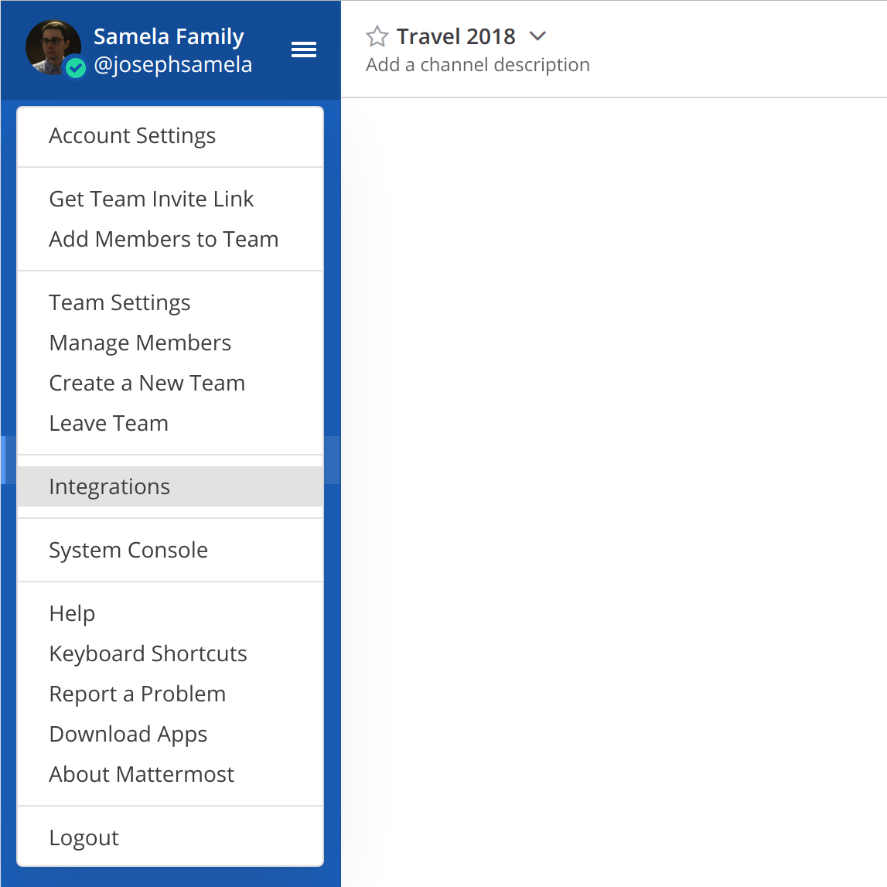
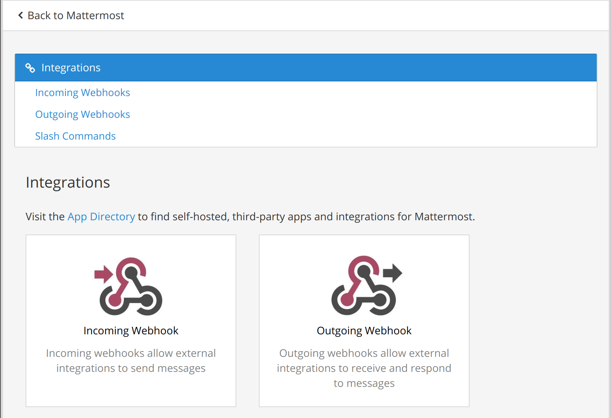
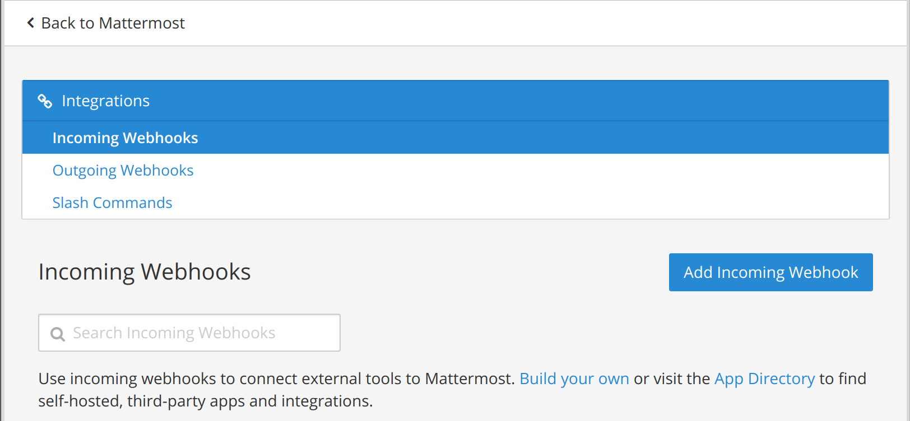
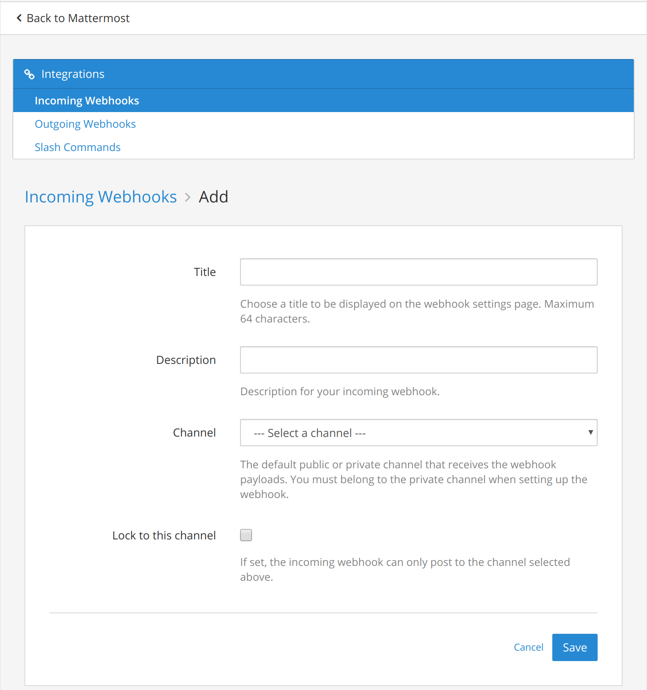
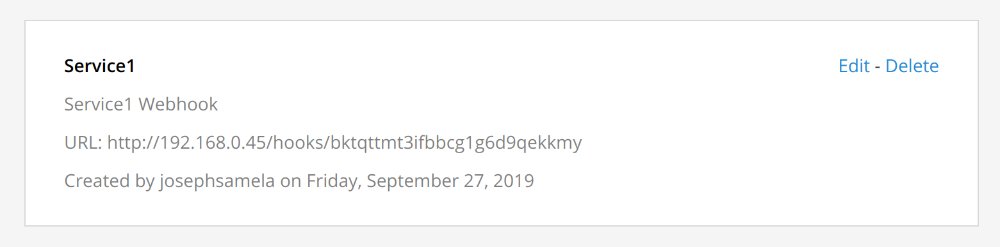

# mattermost-bot-python

*Mattermost Bot Written...in python!*


Writing a mattermost bot is easy as sending a single post request! 

>*But wait*! Where do I send the request?! What is the format?!

## 1. Where do I send the request?

Open the hamburger menu and click on "Integrations".

In the Integration Menu, click "Incoming Webhook".

Click "Add Incoming Webhook". 

Complete the form!

Your newly created webhook is ready! Copy the webhook url.


## 2. What does a request look like?

A basic request looks like this:

```json
    {
        'username': 'Obi-Wan Kenobi',
        'icon_url': 'https://bit.ly/2nQZ6vg',
        'text'    : 'It\'s over Anakin! I have the high ground.'
    }
```
> `username` is the username of the message.
>
> `icon_url` is the url of the user icon.
>
> `text` is the text message. You can use mattermost markdown syntax to format code-blocks, tables, emoji, gifs and more!

Optionally you can add additional channels to customize messages. For example the `channel` allows you to specify on what channel to post the message. If un-specified it will post to the default channel selected when the webhook was created.

```json
    {
        'channel' : 'Mustafar',
        'username': 'Obi-Wan Kenobi',
        'icon_url': 'https://bit.ly/2nQZ6vg',
        'text'    : 'It\'s over Anakin! I have the high ground.'
    }
```

## 3. How do I send the request?

Sending is the easiest part! Send the message as a json string to the webhook url. You can use tools like `curl` or `postman` to experiment with message format. Pretty much every modern language has http libraries so pick your favorite!

Here's a simple example bot in python.

```python
import requests
import json

def main():
    # Specify Mattermost webhook url to send message
    url = "https://mattermost.domain.com/hooks/bktqttmt3ifbbcg1g6d9qekkmy"

    # Create message payload per mattrermost API documentation:
    # https://docs.mattermost.com/developer/webhooks-incoming.html#parameters-and-formatting
    messages = [
        {
             'username': 'Obi-Wan Kenobi',
             'icon_url': 'https://bit.ly/2nQZ6vg',
             'text'    : 'It\'s over Anakin! I have the high ground.'
        },
        {
          'username': 'Anakin Skywalker',
          'icon_url': 'https://bit.ly/2njSENj',
          'text': 'You underestimate my power!'
        }
    ]

    # Post above messages!
    for message in messages:
        post_to_mattermost(url, json.dumps(message))

def post_to_mattermost(url, message):
    # Send payload as HTTP Post Request to Webhook URL
    r = requests.post(
        url,
        data=message
    )
    r.raise_for_status()

if (__name__) == '__main__':
    main()
```
